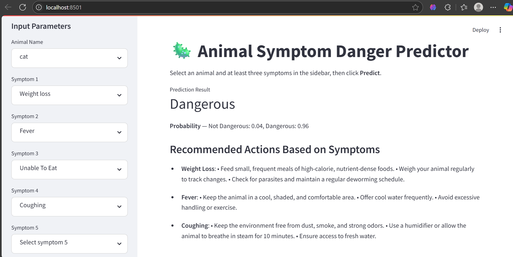

# 🐾 Animal Health Prediction and Precaution System

A Streamlit-based machine learning web application that predicts possible health issues in animals based on symptoms and suggests suitable precautions.

## 🖼️ Application Screenshot

Below is a screenshot of the application's home page:



## 📌 Project Overview

Animal diseases often go unnoticed until they reach a critical stage. Early detection and preventive actions can help reduce livestock loss and improve animal health. This system allows users (e.g., farmers, veterinarians) to input symptoms observed in animals, predicts the possible disease or condition using a trained machine learning model, and provides recommended **precautions**.

---

## ✅ Features

- Symptom-based prediction using Random Forest Classifier
- Suggests appropriate precautions
- Interactive web interface using **Streamlit**
- Uses label and one-hot encoding
- Reads and displays symptoms/data from preprocessed `.csv` and `.txt` files
- Simple and user-friendly interface

---

## 🗂️ Project Structure

```
project-root/
│
├── app.py                       # Main Streamlit web application
├── animalpredictionjup.ipynb    # Jupyter Notebook for model development
├── data.csv                     # Original dataset
├── cleaned_data.csv             # Preprocessed dataset
├── label_encoder.pkl            # Saved LabelEncoder for symptoms/diseases
├── onehot_encoder.pkl           # Saved OneHotEncoder for input features
├── random_forest_model.joblib   # Trained Random Forest model
├── symptoms_precautions.txt     # Mapping of symptoms and precautions
├── README.md                    # Project documentation
```

---

## 🔧 Installation and Setup

1. **Clone the repository**
   ```bash
   git clone https://github.com/IbrahimBagwan1/ML-Animal-Health-Prediction.git
   cd animal-health-prediction
   ```

2. **Create a virtual environment (optional but recommended)**
   ```bash
   python -m venv venv
   # On Windows:
   venv\Scripts\activate
   # On Linux/Mac:
   source venv/bin/activate
   ```

3. **Install required packages**
   ```bash
   pip install -r requirements.txt
   ```

4. **Run the application**
   ```bash
   streamlit run app.py
   ```

---

## 💡 How to Use

- Run `app.py` in Streamlit.
- Enter symptoms observed in the animal (select from list/multiselect).
- Click **Predict**.
- View the predicted disease name and precautionary steps.

---

## 🧠 Model Details

- **Algorithm Used:** Random Forest Classifier
- **Input:** One-hot encoded symptoms
- **Output:** Predicted disease

**Model Files:**
- `random_forest_model.joblib`
- `label_encoder.pkl`
- `onehot_encoder.pkl`

---

## 🧰 Technologies Used

- Python
- Streamlit (UI)
- scikit-learn (model training, encoding)
- pandas (data handling)
- joblib, pickle (model/encoder serialization)

---

## 🚀 Future Enhancements

- Add multilingual support for farmers in local languages
- Integrate speech-based input
- Extend to multiple animal species (cattle, goats, poultry)
- Incorporate temperature, age, breed, and other metadata
- Add database storage for tracking animal history

---

## 🤝 Contribution

Pull requests are welcome! To contribute:

1. Fork the repo
2. Create a new branch (`feature/your-feature`)
3. Commit your changes
4. Push to the branch
5. Open a pull request

---

## 📄 License

This project is open-source and available under the MIT License.

---

## 👨‍💻 Author

**Ibrahim Bagwan**  
Artificial Intelligence and Machine Learning Student  
R.V. College of Engineering
